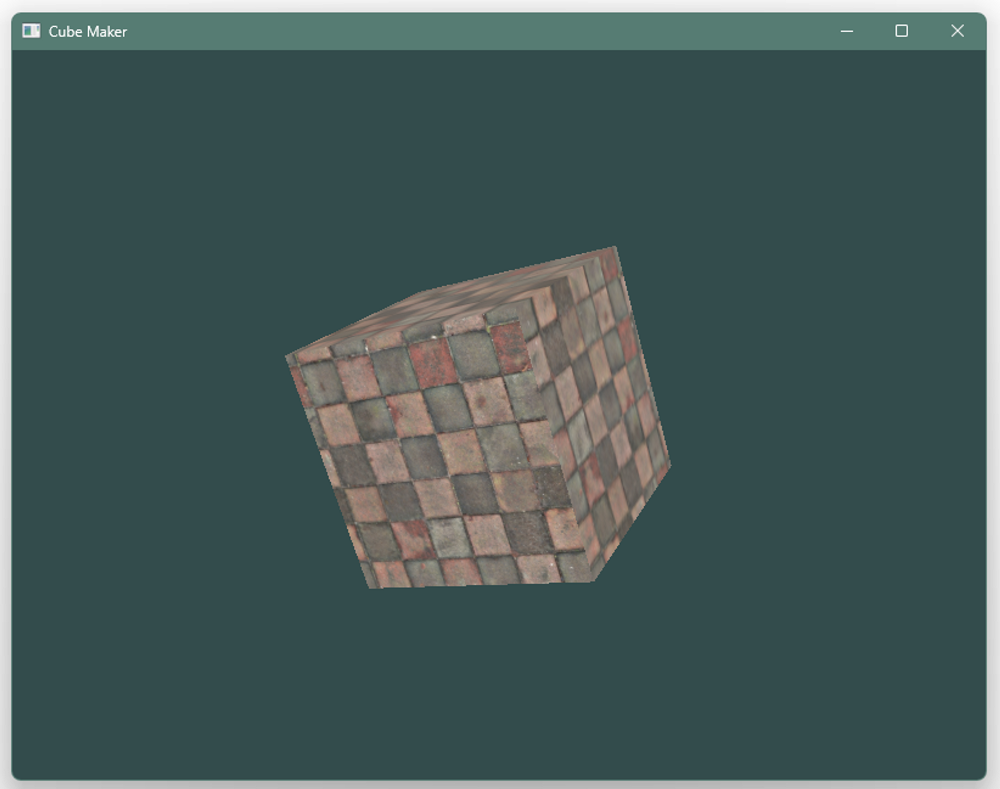
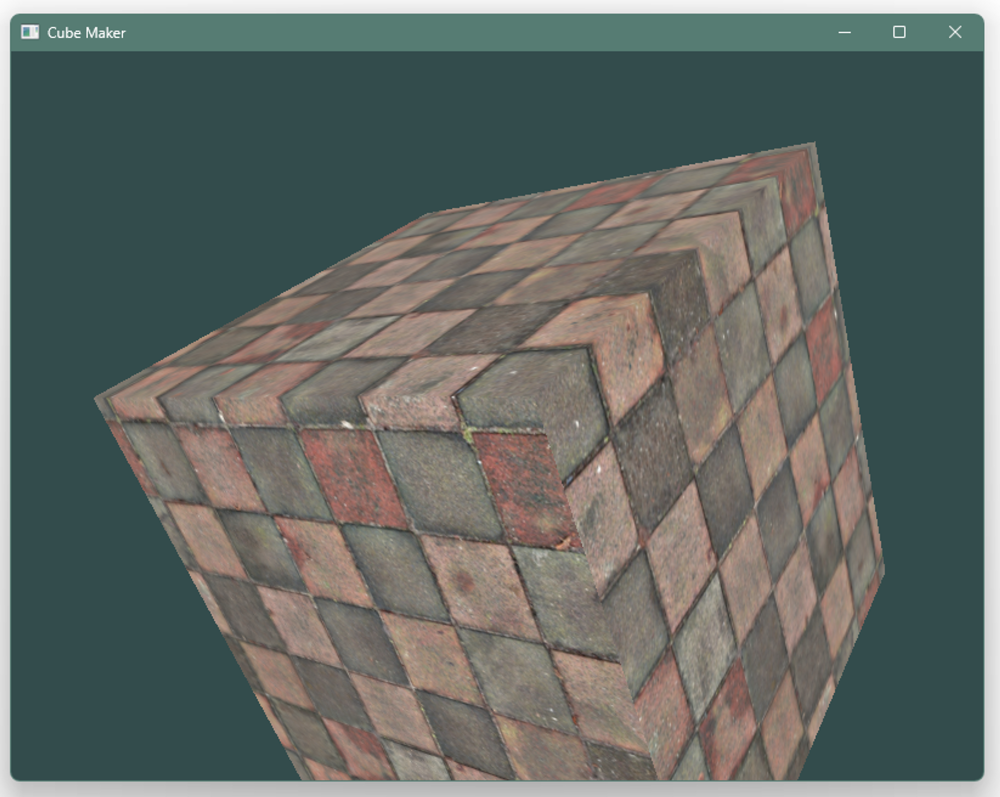

# 쌓기나무 (Stacking Cubes)

## [Notion Project Page](https://habijung.notion.site/Stacking-Cubes-657d2e32e28f4cd4a65709e592dfb380?pvs=4)

## 개요

어릴 때 자주 접했던 **쌓기나무** 놀이를 **C++ OpenGL**로 구현한 프로젝트

2019년 선택과목 컴퓨터 그래픽스 (Computer Graphics) 수업을 들을 때, 다른 팀에서 2D 평면도의 그림을 3D 쌓기나무로 변환하는 프로젝트를 발표했었다.

깔끔하게 잘 만들었다는 느낌과 함께 정말 인상깊게 남아있어서 그 때의 기억으로 이를 구현하고 싶은 생각이 아주 오래 있었고, 지금에서야 한 번 시도하려고 한다.

그리고 또 어떤 게임에서 큐브를 활용하는 퍼즐이 있는데, 이를 보고 묵혀왔던 큐브 프로젝트가 생각나서 한 번 시도하게 되었다.

## 목표

### 필수

- 일단 기억나는 느낌의 2D 평면도를 3D로 바꿔주는 것을 최우선 목표로 잡고 만들기

### 선택

- 3D 쌓기나무에 기본적인 마우스 컨트롤 추가
- 3D 쌓기나무에 여러 방향의 평면도 투영 추가
- 3D 쌓기나무에서 회전 상호작용 추가

## 현재까지의 결과

