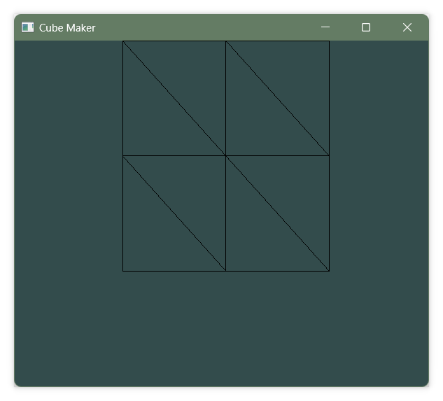

# Cube Maker

## 개요

This project is the implementation of the childhood favorite game of stacking cubes.

If draw color pixel in 2D coordinate system, it can convert and render to 3D viewer.

## Objects

- Learn C++
- Learn OpenGL
- Manage own project

## Progress Result

